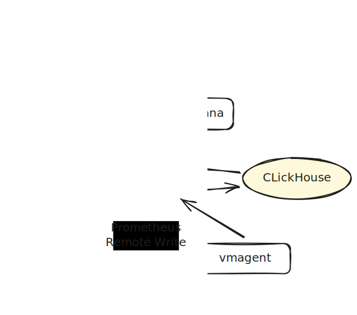

# Pluto

Pluto is a high-performance Prometheus remote write adapter that stores metrics in ClickHouse. It provides a scalable and efficient way to handle large volumes of time-series data from Prometheus.

## Features

- **High Performance**: Optimized for high-throughput ingestion and querying of metrics
- **ClickHouse Integration**: Leverages ClickHouse's columnar storage for efficient compression and querying
- **Prometheus Compatible**: Implements Prometheus remote write API and storage interface
- **Sharding Support**: Built-in support for horizontal scaling through sharding
- **Downsampling**: Automatic downsampling of historical data to reduce storage costs
- **Debug Endpoints**: Includes metrics and pprof endpoints for monitoring and profiling
- **Web Interface**: Built-in Prometheus web UI for querying and visualizing metrics

## Architecture



## Installation

### From Source

```bash
git clone https://github.com/pluto-metrics/pluto.git
cd pluto
go build -o pluto ./cmd/pluto
```

### Using Docker

```bash
docker build -t pluto .
```

## Configuration

Pluto uses a YAML configuration file. See `config.yaml` for a complete example.

Key configuration sections:

- **clickhouse**: ClickHouse connection settings
- **insert**: Remote write receiver configuration
- **prometheus**: Prometheus storage interface settings
- **debug**: Debug endpoints (metrics, pprof)

## Usage

### Basic Setup

1. Start ClickHouse
2. Create tables using the schema from `example/simple/init.sql`
3. Configure Pluto with your ClickHouse connection
4. Start Pluto
5. Configure Prometheus to use Pluto as remote write endpoint

### Remote Write

Pluto accepts Prometheus remote write requests at `/api/v1/write` on the configured insert port.

### Querying

Pluto implements the Prometheus storage interface, allowing it to be used as a drop-in replacement for Prometheus storage.

## Examples

See the `example/` directory for complete setups:

- **simple**: Basic setup with single ClickHouse instance
- **sharding**: Horizontal scaling with multiple shards
- **downsampling**: Automatic data downsampling for long-term storage

## Table Schema

The ClickHouse table schema is defined in [example/simple/init.sql](example/simple/init.sql).

## License

Licensed under the Apache License 2.0. See [LICENSE](LICENSE) for details.
